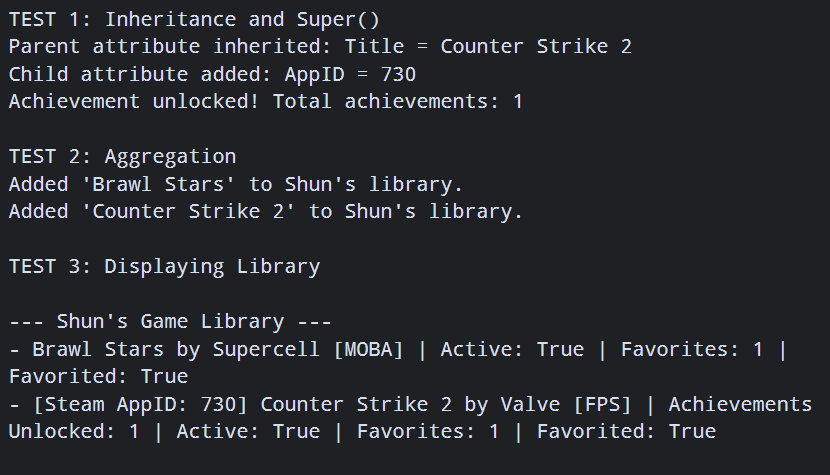

# Advanced Class Relationships

## Previous Activities

[classAttrib](classAttributesMethods.md)

[classRel](classRelationships.md)

## Existing System Description:
Class 1: UserLibrary manages collections of the entries.

Class 2: GameDirectory that represents individual video games with status and favorite tracking.

Existing Problems and Limitations:
The original GameDirectory class is too much of a surface level and didn't handle specific datas like Steam achievements.

## Inheritance Relationship

Parent: GameDirectory

Child: SteamGame

Explanation: SteamGame IS-A specific type of GameDirectory. It inherits properties like title, developer, genre, statis, and favorite tracking, whilst addiing Steam-specific attributes such as App Id and Unlocked Achievements.

## Inheritance UML

## Composition/Aggregation

Relationship: Aggregation

Explanation: UserLibrary holds a list of GameDirectory (and SteamGame) objects. It is Aggregation because games exist independently in the global directory even if removed from a user's library or if the library object is destroyed.

## Advanced UML Diagram

## Python Implementation
[Source Code](advancedRelationships.py)

## Test Run

## Object Diagram

## Reflection

1. Why did you choose your inheritance relationship? Explain why your child class is a type of your parent class.

I chose  SteamGame as a child class because a Steam game is a specific type of a general video game entry. It requires all functionality like titles, status toggles, and favorites, but also needs attributes specifically relevant to Steam's ecosystem, such as App IDs and unlocked achievements.

2. How did inheritance reduce duplicate code? Identify attributes or methods that were reused.

Inheritance eliminated retyping base attributes andmethods like toggleFavorite() in SteamGame. By calling super().__init__(), the child class reuses parent setup logic and only defines its new features.

3. Why is your HAS-A relationship Composition or Aggregation? Explain the lifecycle relationship
between the two objects.

It is Aggregation because UserLibrary holds references to game objects that exist independently. If a UserLibrary instance is deleted, the GameDirectory objectcs remain in memory.

4. What is the difference between Association from Part III and the advanced relationship you
implemented?

Part III used a general link showing a library manages games. The advanced design introduced an "IS-A" hierarchy with inheritance and clealry defined object independence with Aggregation.

5. How does your design follow the DRY principle?

It prevents code duplication by centraliziing shared behavior in GameDirectory. Any future updates to core game tracking only need to be written once in the parent class.
