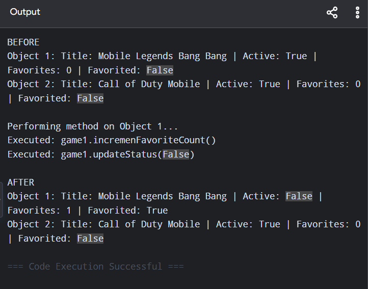
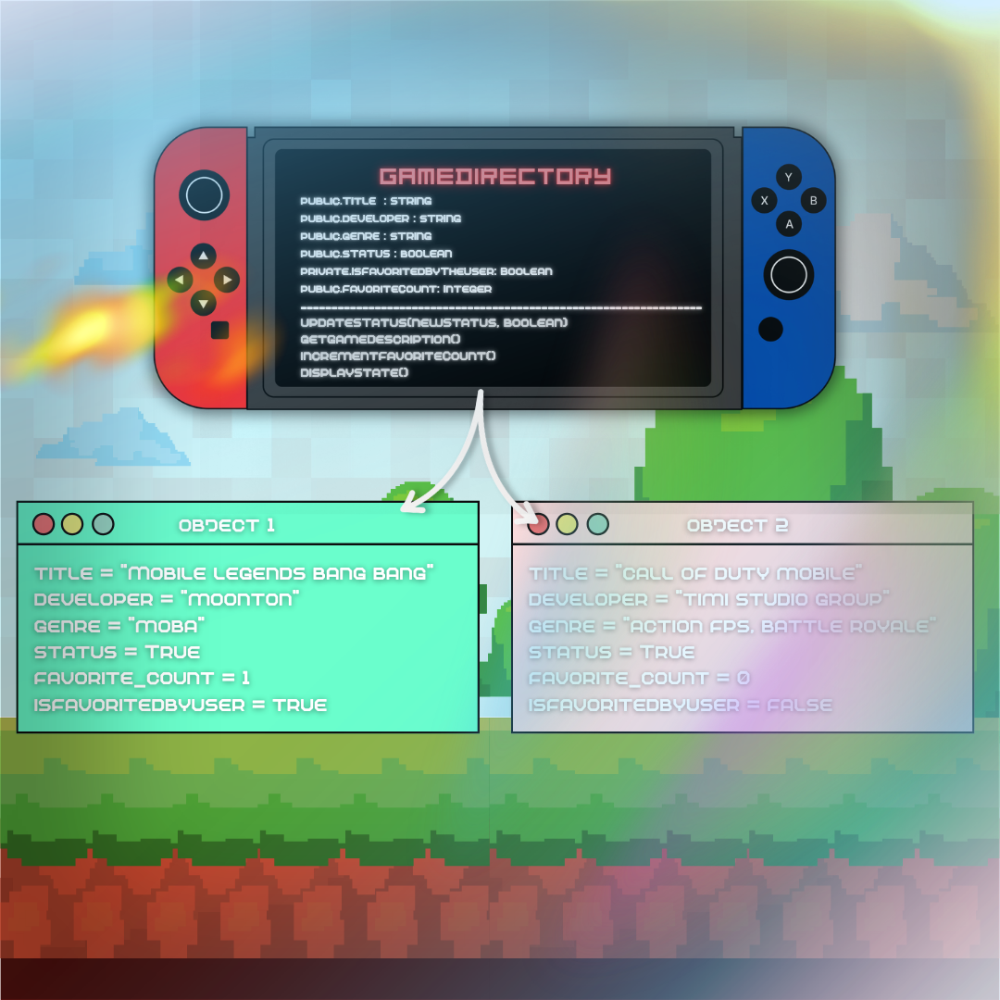

# Class Attributes and Methods

## Previous Design

Link to my previous activity:
[classObjectUML.md](classObjectUML.md)

## Design Revision

Added a parameter (newStatus: Boolean) to updateStatus() so that the game's state can be dynamically changed.

Added method: displayState().

## Visibility Decisions
| Attribute | Data Type | Visibility | Reason |
|---|---|---|---|
| Title | String | Public | Essential identifier that must be easily searchable across the directory.
| Developer | String | Public | Genral data that users need to filter or browse games by studio. |
| Genre | String | Public | Basic category information used to recommend games matching user preferences. |
| Status | Boolean | Public | Allows direct access for status updates across the diectory. |
| IsFavoritedByTheUser | Boolean | Private | To prevent tampering and ensure personal user status remains protected. |
| FavoriteCount | Integer | Public | Allows direct read access for displaying community metrics on search |

## Updated UML Class Diagram

!

## Python Implementation

[View Python Source](classImplementation.py)

## Test Run

## Object Diagram

## Analysis

### Why did you make your chosen attribute private?

The IsFavoritedByTheUser attribute was made private to encapsulate the current user's state. Keeping this attribute private prevents tampering and it ensures the user's personal status remains protected.

### Which method changes the state of your object?

Both updateStatus and incrementFavoriteCount change the objects's state. updateStatus directly updates the public Status attribute based on the passed parameter, while incrementFavoriteCount toggles IsFavoritedByTheUser and updates FavoriteCount.

### How did your two objects demonstrate that instances are independent?

When methods were performed on object 1, its internal dtaa updated accordingly, while the object 2 reamained the exact initial values. This confirms that each object instance is independent.

### What is the difference between your class diagram and your object diagram?

The class diagram outlines the blueprint of the system, while the object diagram displays concrete instances at a specific point during runtime, showing real data assigned to distinct objects.

