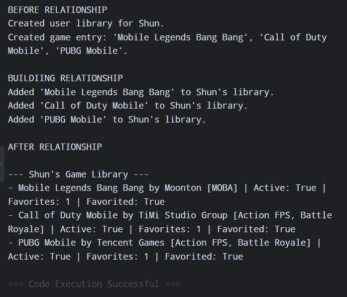

# Class Relationships: Association and Multiplicity
## Previous Work
[Part I - Classes and Objects](classObjectUML.md)
[Part II - Class Attributes and Methods](classAttributesMethods.md)

## Existing Class

Class: GameDirectory

Description: GameDirectory represents a video game listed in a discovery library that tracks community interest and helps users find titles matching their preferences.

## New Related Class

Class: UserLibrary

Description: UserLibrary represents the user's library, where they can manage, organize, and favorite multiple games.

## Association

Relationship: UserLibrary manages GameDirectory

Explanation: A Userlibrary object contains and manages GameDirectory Objects as the user discovers and adds games over time.

## Multiplicity

Multiplicity: 1:0

Explanation: One UserLibrary belongs to exactly one user, but it can contain zero or more GameDirectory objects as the user discovers and adds games over time.

## UML Class Relationship Diagram

## Python Implementation
[View Python Source](classRelationships.py)

## Test Run

## Object Relationship Diagram

## Analysis

### What is the association between your two classes?
The association between the two classes is a "has-a" relationship where one manages multiple objects. In this system, the library acts as a collection interface for a user, allowing them to register, organize, and view details about the games they are interested in tracking.

### What multiplicity did you choose and why?
I chose a 1 to 0... multiplicity because a single user library is tied to one specific user, but it can contain anywhere from zero games to many games as the user adds titles over time. This structure fits real-world software design where users dynamically add or remove items from a library without changing the existence of the library container itself. 

### How did you implement the relationship in Python?
Using a private list called __games inside the UserLibrary class. The method addGame(self, game_entry) receives an instance of GameDirectory as a parameter and appends that object reference directy to the self.__games list.

### Why did you store an object reference instead of copying its data?
Storing object references ensures that both the UserLibrary container and external scripts interact with the exact same instance in memory.

### If your relationship uses many, why is a list appropriate?
A Python list is appropriate for a one-to-many relationship because it dynamically resizes as objects are added or removed, maintaining an ordered collection of object references. Rather than holding copies of string names, the list stores memory pointers to the actual GameDirectory objects, allowing the program to iterate over the collection and invoke instance menthods dynamically.
